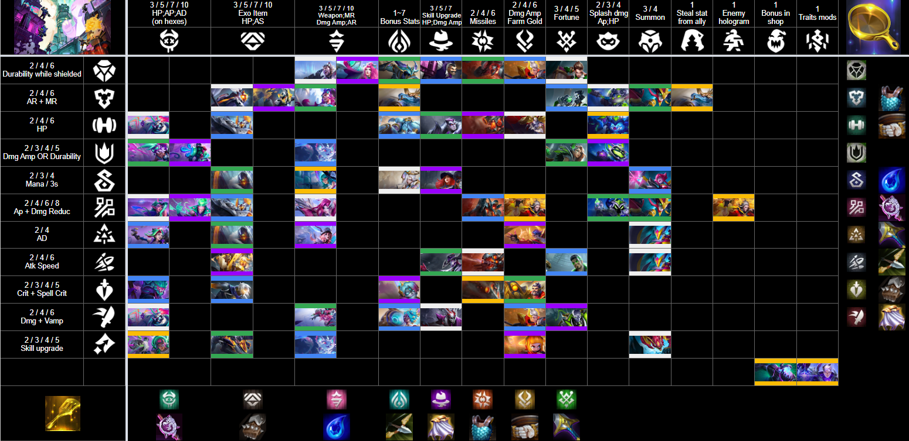
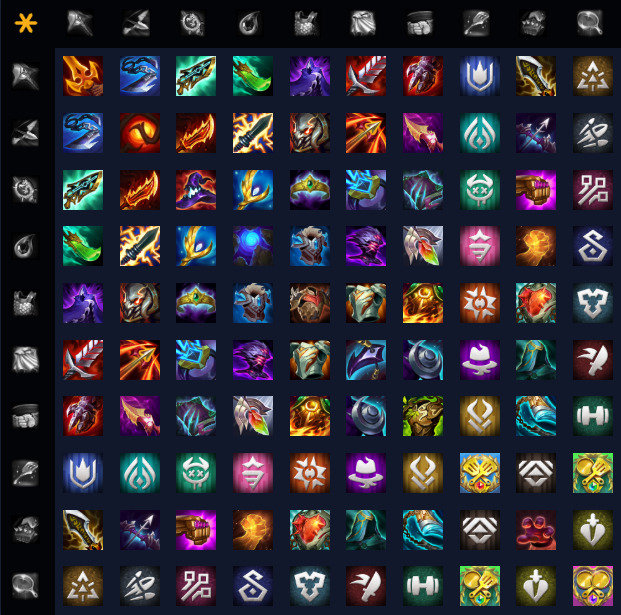
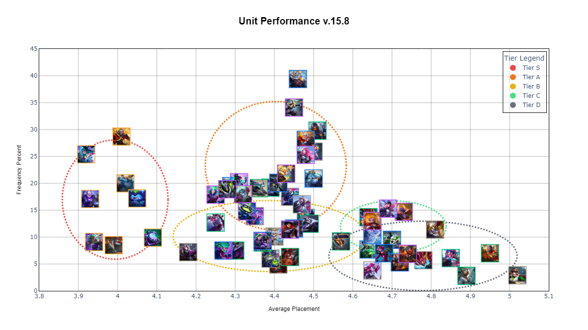
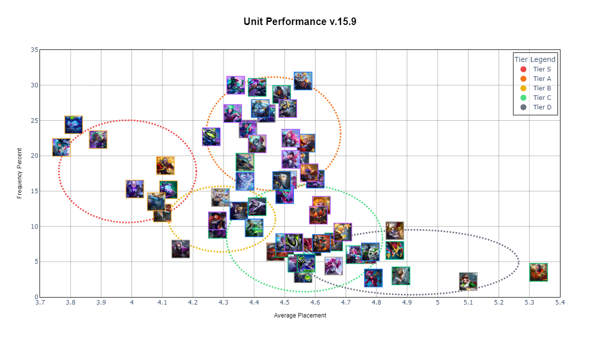
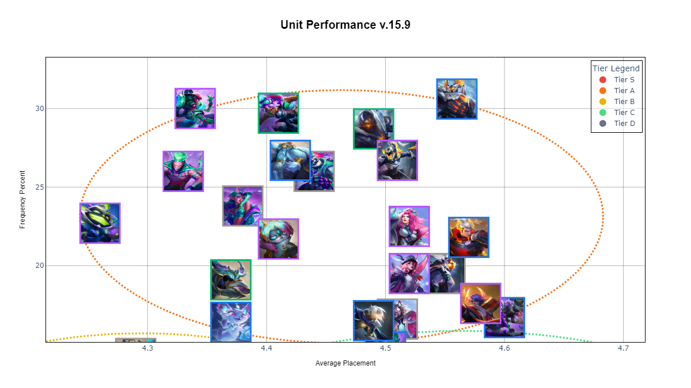
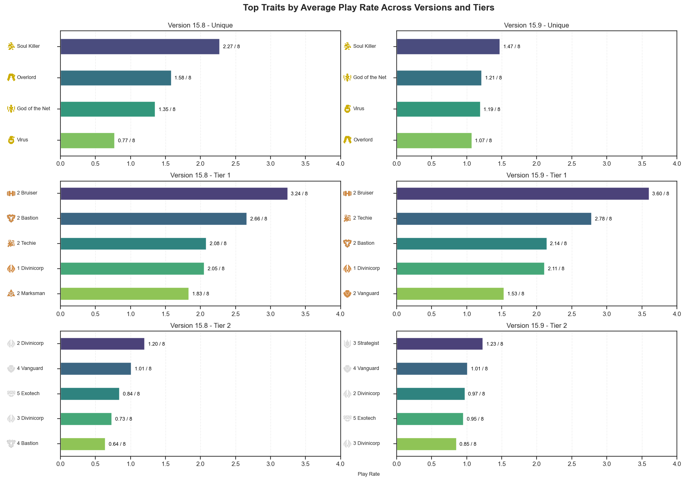
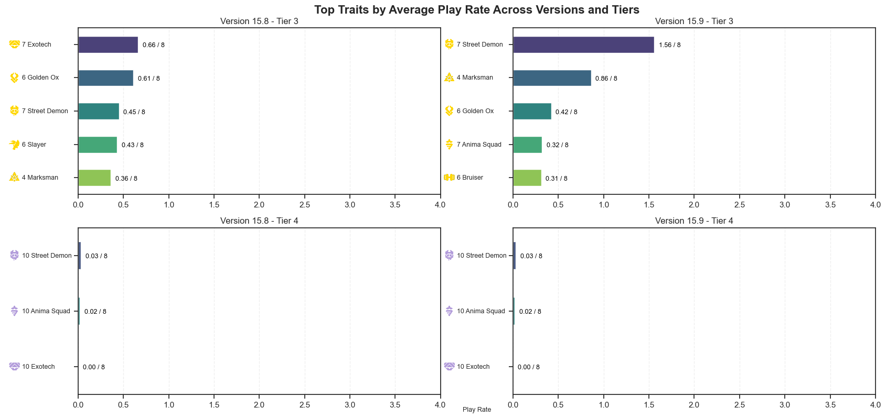
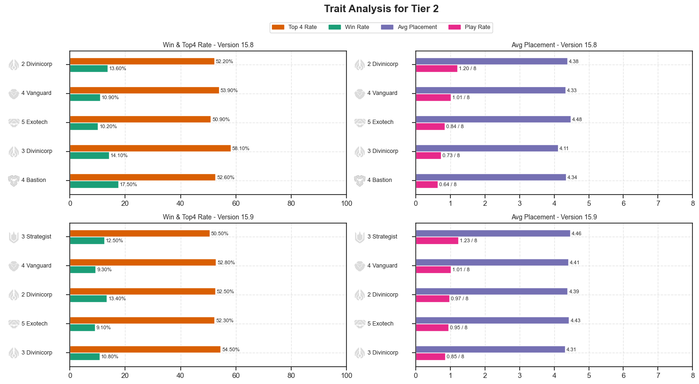
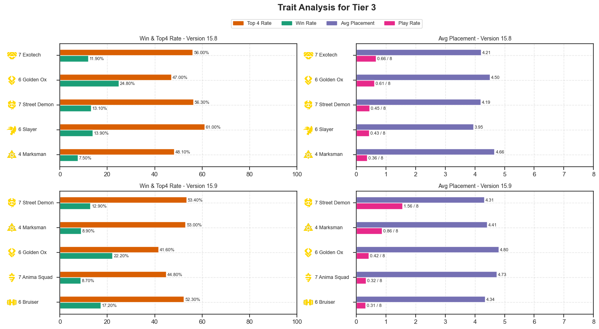

<h1 align="center">Data Summary Report</h1>

## Abstract

This document presents an analysis of Teamfight Tactics (TFT) match data,
focusing on unit efficiency, item performance, and composition outcomes.
The findings provide recommendations to improve strategy formulation.

  <h3>Table of Contents</h3>
  <ul style="list-style: none; padding-left: 0;">
    <li><a href="#data-summary">1. Data Summary</a></li>
    <li><a href="#exploratory-data-analysis">2. Exploratory Data Analysis</a>
    <li><a href="#data-visualization">3. Data Visualization</a></li>
    <li><a href="#conclusion">4. Conclusion and Next Steps</a></li>
  </ul>

## 1. Data Summary {#data-summary}

In this summary, we are working with the Data Analyst of Teamfight Tactics (Set 14).

  <!-- Wider Figure (2 parts) -->
  <figure style="display: flex; flex-direction: column; align-items: center; flex: 3; margin: 0;">
    
    <figcaption style="text-align: center; margin: 0;">
      Figure 1. Cheat Sheet of Trait and Unit in Set 14 
      (Thanks for this <a href="https://docs.google.com/spreadsheets/d/e/2PACX-1vSHGdebCDDewSHEDIooGU7k4XdirFTsO4lHSjOwmFc__YXBJKszM-4Bm307AkWP5HdTACJB43UfGCRI/pubhtml">Google Sheet link</a>).
    </figcaption>
  </figure><figure style="display: flex; flex-direction: column; align-items: center; flex: 1; margin: 0;">
    
    <figcaption style="text-align: center; margin: 0;">
      Figure 2.  Cheat Sheet of Items for Set 14.
    </figcaption>
  </figure>

From the raw data, four DataFrames are derived:
    - Matches: Match metadata including version, date, and duration.
    - Participants: Player-specific information such as placement and level.
    - Units: Details about units placed on the board.
    - Traits: Trait activations and bonuses.

### 1.1. Matches

  <table style="width: 1000px; border-collapse: collapse; border: 1px solid #000;">
    <thead style="background-color: #aaaaaa;">
      <tr>
        <th style="width: 200px; border: 1px solid #000;">Column</th>
        <th style="width: 150px; border: 1px solid #000;">Type</th>
        <th style="width: 650px; border: 1px solid #000;">Description</th>
      </tr>
    </thead>
    <tbody>
      <tr>
        <td style="border: 1px solid #000;"><strong>match_id</strong></td>
        <td style="border: 1px solid #000;"><em>string</em></td>
        <td style="border: 1px solid #000;">Unique match identifier for the match</td>
      </tr>
      <tr>
        <td style="border: 1px solid #000;"><strong>game_datetime</strong></td>
        <td style="border: 1px solid #000;"><em>datetime</em></td>
        <td style="border: 1px solid #000;">Time when the game started</td>
      </tr>
      <tr>
        <td style="border: 1px solid #000;"><strong>game_duration</strong></td>
        <td style="border: 1px solid #000;"><em>float64</em></td>
        <td style="border: 1px solid #000;">Duration of the game in seconds</td>
      </tr>
      <tr>
        <td style="border: 1px solid #000;"><strong>game_version</strong></td>
        <td style="border: 1px solid #000;"><em>string</em></td>
        <td style="border: 1px solid #000;">Game patch version indicating the TFT set version (patch/version)</td>
      </tr>
      <tr>
        <td style="border: 1px solid #000;"><strong>tft_set_number</strong></td>
        <td style="border: 1px solid #000;"><em>int64</em></td>
        <td style="border: 1px solid #000;">TFT set number of the game version</td>
      </tr>
    </tbody>
  </table>

### 1.2. Participants

  <table style="width:1000px; border-collapse:collapse; border: 1px solid #000;">
    <thead style="background-color:#aaaaaa">
      <tr>
        <th style="width:200px; border:1px solid #000;">Column</th>
        <th style="width:150px; border:1px solid #000;">Type</th>
        <th style="width:650px; border:1px solid #000;">Description</th>
      </tr>
    </thead>
    <tbody>
      <tr>
        <td style="border:1px solid #000;"><strong>game_version</strong></td>
        <td style="border:1px solid #000;"><em>string</em></td>
        <td style="border:1px solid #000;">Game patch version indicates the TFT set version</td>
      </tr>
      <tr>
        <td style="border:1px solid #000;"><strong>match_id</strong></td>
        <td style="border:1px solid #000;"><em>string</em></td>
        <td style="border:1px solid #000;">Unique match identifier for the match</td>
      </tr>
      <tr>
        <td style="border:1px solid #000;"><strong>puuid</strong></td>
        <td style="border:1px solid #000;"><em>string</em></td>
        <td style="border:1px solid #000;">Unique identifier for the player</td>
      </tr>
      <tr>
        <td style="border:1px solid #000;"><strong>placement</strong></td>
        <td style="border:1px solid #000;"><em>int64</em></td>
        <td style="border:1px solid #000;">Final position of the player in the match (1 = 1st place, 8 = last)</td>
      </tr>
          <tr>
        <td style="border:1px solid #000;"><strong>level</strong></td>
        <td style="border:1px solid #000;"><em>int64</em></td>
        <td style="border:1px solid #000;">Player level at the end of the game</td>
      </tr>
    </tbody>
  </table>

### 1.3. Units

  <table style="width:1000px; border-collapse:collapse; border: 1px solid #000;">
    <thead style="background-color:#aaaaaa">
      <tr>
        <th style="width:200px; border:1px solid #000;">Column</th>
        <th style="width:150px; border:1px solid #000;">Type</th>
        <th style="width:650px; border:1px solid #000;">Description</th>
      </tr>
    </thead>
    <tbody>
      <tr>
        <td style="border:1px solid #000;"><strong>game_version</strong></td>
        <td style="border:1px solid #000;"><em>string</em></td>
        <td style="border:1px solid #000;">Game patch version indicates the TFT set version</td>
      </tr>
      <tr>
        <td style="border:1px solid #000;"><strong>match_id</strong></td>
        <td style="border:1px solid #000;"><em>string</em></td>
        <td style="border:1px solid #000;">Unique match identifier for the match</td>
      </tr>
      <tr>
        <td style="border:1px solid #000;"><strong>puuid</strong></td>
        <td style="border:1px solid #000;"><em>string</em></td>
        <td style="border:1px solid #000;">Unique identifier for the player</td>
      </tr>
      <tr>
        <td style="border:1px solid #000;"><strong>character_id</strong></td>
        <td style="border:1px solid #000;"><em>string</em></td>
        <td style="border:1px solid #000;">Unique identifier for the unit</td>
      </tr>
      <tr>
        <td style="border:1px solid #000;"><strong>slot_idx</strong></td>
        <td style="border:1px solid #000;"><em>int64</em></td>
        <td style="border:1px solid #000;">Slot index of the unit on the board</td>
      </tr>
      <tr>
        <td style="border:1px solid #000;"><strong>rarity</strong></td>
        <td style="border:1px solid #000;"><em>int64</em></td>
        <td style="border:1px solid #000;">Value of the unit (0 = 1 gold, 1 = 2 gold, 2 = 3 gold, 4 = 4 gold, 6 = 5 gold)</td>
      </tr>
      <tr>
        <td style="border:1px solid #000;"><strong>tier</strong></td>
        <td style="border:1px solid #000;"><em>int64</em></td>
        <td style="border:1px solid #000;">Star of the unit (1 = 1 star, 2 = 2 stars, 3 = 3 stars, 4 = 4 stars)</td>
      </tr>
      <tr>
        <td style="border:1px solid #000;"><strong>items</strong></td>
        <td style="border:1px solid #000;"><em>list</em></td>
        <td style="border:1px solid #000;">Items the unit carries after the match</td>
      </tr>
    </tbody>
  </table>

### 1.4. Traits

  <table style="width:1000px; border-collapse:collapse; border: 1px solid #000;">
    <thead style="background-color:#aaaaaa">
      <tr>
        <th style="width:200px; border:1px solid #000;">Column</th>
        <th style="width:150px; border:1px solid #000;">Type</th>
        <th style="width:650px; border:1px solid #000;">Description</th>
      </tr>
    </thead>
    <tbody>
      <tr>
        <td style="border:1px solid #000;"><strong>game_version</strong></td>
        <td style="border:1px solid #000;"><em>string</em></td>
        <td style="border:1px solid #000;">Game patch version indicates the TFT set version</td>
      </tr>
      <tr>
        <td style="border:1px solid #000;"><strong>match_id</strong></td>
        <td style="border:1px solid #000;"><em>string</em></td>
        <td style="border:1px solid #000;">Unique match identifier for the match</td>
      </tr>
      <tr>
        <td style="border:1px solid #000;"><strong>puuid</strong></td>
        <td style="border:1px solid #000;"><em>string</em></td>
        <td style="border:1px solid #000;">Unique identifier for the player</td>
      </tr>
      <tr>
        <td style="border:1px solid #000;"><strong>trait_id</strong></td>
        <td style="border:1px solid #000;"><em>string</em></td>
        <td style="border:1px solid #000;">Unique identifier for the trait</td>
      </tr>
      <tr>
        <td style="border:1px solid #000;"><strong>num_units</strong></td>
        <td style="border:1px solid #000;"><em>int64</em></td>
        <td style="border:1px solid #000;">Number of units contributing to the trait bonus for that match</td>
      </tr>
      <tr>
        <td style="border:1px solid #000;"><strong>current_tier</strong></td>
        <td style="border:1px solid #000;"><em>int64</em></td>
        <td style="border:1px solid #000;">Tier of the trait at the end of the match</td>
      </tr>
      <tr>
        <td style="border:1px solid #000;"><strong>max_tier</strong></td>
        <td style="border:1px solid #000;"><em>int64</em></td>
        <td style="border:1px solid #000;">Maximum achievable tier of the trait</td>
      </tr>
      <tr>
        <td style="border:1px solid #000;"><strong>trait_style</strong></td>
        <td style="border:1px solid #000;"><em>int64</em></td>
        <td style="border:1px solid #000;">Style of the trait (0: No style, 1: Bronze, 2: Silver, 3: Unique, 4: Gold, 5: Chromatic)</td>
      </tr>
    </tbody>
  </table>

## 2. Exploratory Data Analysis {#exploratory-data-analysis}

### 2.1. Units Statistics

<strong>Description</strong>

A DataFrame containing statistical information about units in a game. This DataFrame processes data about game participants and their units to compute various statistics, including average placement, frequency, win rate, and top 4 rate.

<strong>Overview</strong>

  <table style="width:1200px; border-collapse:collapse; border: 1px solid #000;">
    <thead style="background-color:#aaaaaa">
      <tr>
        <th style="width:200px; border:1px solid #000;">Column</th>
        <th style="width:1000px; border:1px solid #000;">Description</th>
      </tr>
    </thead>
    <tbody>
      <tr>
        <td style="border:1px solid #000;"><strong>game_version</strong></td>
        <td style="border:1px solid #000;">Game patch version indicates the TFT set version</td>
      </tr>
      <tr>
        <td style="border:1px solid #000;"><strong>character_id</strong></td>
        <td style="border:1px solid #000;">Unique identifier for the unit (60 unique units)</td>
      </tr>
      <tr>
        <td style="border:1px solid #000;"><strong>rarity</strong></td>
        <td style="border:1px solid #000;">Value of the unit</td>
      </tr>
      <tr>
        <td style="border:1px solid #000;"><strong>frequency</strong></td>
        <td style="border:1px solid #000;">Proportion of usage, expressed as a percentage (%), showing how often the unit is used in games</td>
      </tr>
      <tr>
        <td style="border:1px solid #000;"><strong>avg_place</strong></td>
        <td style="border:1px solid #000;">Average placement of the unit (lower than 4.5 is considered better)</td>
      </tr>
      <tr>
        <td style="border:1px solid #000;"><strong>win</strong></td>
        <td style="border:1px solid #000;">Win rate, representing the proportion of games where the unit finishes first</td>
      </tr>
      <tr>
        <td style="border:1px solid #000;"><strong>top4</strong></td>
        <td style="border:1px solid #000;">Top 4 rate, representing the proportion of games where the unit finishes in the top 4</td>
      </tr>
    </tbody>
  </table>

### 2.2. Items Statistics

#### a) Items

<strong>Description</strong>

A DataFrame containing statistical information about items in games. This DataFrame processes various common statistics for items and top units associated with each item. It also classifies items into different types (e.g., Craftable, Radiant, Artifact, etc.) and organizes the output for clean presentation.

<strong>Overview</strong>

  <table style="width:1200px; border-collapse:collapse;">
    <thead style="background-color:#aaaaaa">
      <tr>
        <th style="width:200px; border:1px solid #000;">Column</th>
        <th style="width:1000px; border:1px solid #000;">Description</th>
      </tr>
    </thead>
    <tbody>
      <tr>
        <td style="border:1px solid #000;"><strong>game_version</strong></td>
        <td style="border:1px solid #000;">Game patch version indicates the TFT set version</td>
      </tr>
      <tr>
        <td style="border:1px solid #000;"><strong>items</strong></td>
        <td style="border:1px solid #000;">Unique identifier for the item (152 unique items)</td>
      </tr>
      <tr>
        <td style="border:1px solid #000;"><strong>frequency</strong></td>
        <td style="border:1px solid #000;">Proportion of usage, expressed as a percentage (%), showing how often the item is used in games</td>
      </tr>
      <tr>
        <td style="border:1px solid #000;"><strong>play_rate</strong></td>
        <td style="border:1px solid #000;">Proportion of usage (range: 0 to 8), showing the number of players (out of 8) using the item in a single match</td>
      </tr>
      <tr>
        <td style="border:1px solid #000;"><strong>avg_place</strong></td>
        <td style="border:1px solid #000;">Average placement of players using the item (lower than 4.5 is considered better)</td>
      </tr>
      <tr>
        <td style="border:1px solid #000;"><strong>win</strong></td>
        <td style="border:1px solid #000;">Win rate, representing the proportion of games where the item contributed to a first-place finish</td>
      </tr>
      <tr>
        <td style="border:1px solid #000;"><strong>top4</strong></td>
        <td style="border:1px solid #000;">Top 4 rate, representing the proportion of games where the item contributed to a top 4 finish</td>
      </tr>
      <tr>
        <td style="border:1px solid #000;"><strong>top4</strong></td>
        <td style="border:1px solid #000;">List of the top 10 units that carry this item most frequently, including related stats such as frequency, avg_place, unit_delta, item_delta, win, and top4</td>
      </tr>
      <tr>
        <td style="border:1px solid #000;"><strong>type</strong></td>
        <td style="border:1px solid #000;">The item type (e.g., <b>Craftable</b>: made from two components, <b>Radiant</b>: enhanced version of a craftable item, etc.)</td>
      </tr>
    </tbody>
  </table>

#### b) Items build

<strong>Description</strong>

A DataFrame containing statistical information about item builds on each unit in a game. This DataFrame processes data about game participants and their units with these item builds to compute various common statistics.

<strong>Overview</strong>

  <table style="width:1200px; border-collapse:collapse;">
    <thead style="background-color:#aaaaaa">
      <tr>
        <th style="width:200px; border:1px solid #000;">Column</th>
        <th style="width:1000px; border:1px solid #000;">Description</th>
      </tr>
    </thead>
    <tbody>
      <tr>
        <td style="border:1px solid #000;"><strong>game_version</strong></td>
        <td style="border:1px solid #000;">Game patch version indicates the TFT set version</td>
      </tr>
      <tr>
        <td style="border:1px solid #000;"><strong>character_id</strong></td>
        <td style="border:1px solid #000;">Unique identifier for the unit (60 unique units)</td>
      </tr>
      <tr>
        <td style="border:1px solid #000;"><strong>rarity</strong></td>
        <td style="border:1px solid #000;">Value of the unit</td>
      </tr>
      <tr>
        <td style="border:1px solid #000;"><strong>item_build</strong></td>
        <td style="border:1px solid #000;">List of items that this unit carries</td>
      </tr>
      <tr>
        <td style="border:1px solid #000;"><strong>frequency</strong></td>
        <td style="border:1px solid #000;">Proportion of usage, expressed as a percentage (%), showing how often the unit has this item build is used in games</td>
      </tr>
      <tr>
        <td style="border:1px solid #000;"><strong>avg_place</strong></td>
        <td style="border:1px solid #000;">Average placement of the unit (lower than 4.5 is considered better)</td>
      </tr>
      <tr>
        <td style="border:1px solid #000;"><strong>win</strong></td>
        <td style="border:1px solid #000;">Win rate, representing the proportion of games where the unit has this item build finishes first</td>
      </tr>
      <tr>
        <td style="border:1px solid #000;"><strong>top4</strong></td>
        <td style="border:1px solid #000;">Top 4 rate, representing the proportion of games where the unit has this item build finishes in the top 4</td>
      </tr>
    </tbody>
  </table>

### 2.3. Traits Statistics

<strong>Description</strong>

A DataFrame containing statistical information about traits in a game. This DataFrame processes data about game participants and their traits to compute various common statistics.

<strong>Overview</strong>

  <table style="width:1200px; border-collapse:collapse;">
    <thead style="background-color:#aaaaaa">
      <tr>
        <th style="width:200px; border:1px solid #000;">Column</th>
        <th style="width:1000px; border:1px solid #000;">Description</th>
      </tr>
    </thead>
    <tbody>
      <tr>
        <td style="border:1px solid #000;"><strong>game_version</strong></td>
        <td style="border:1px solid #000;">Game patch version indicates the TFT set version</td>
      </tr>
      <tr>
        <td style="border:1px solid #000;"><strong>trait_id</strong></td>
        <td style="border:1px solid #000;">Unique identifier for the trait (25 unique traits)</td>
      </tr>
      <tr>
        <td style="border:1px solid #000;"><strong>current_tier</strong></td>
        <td style="border:1px solid #000;">Tier of the trait at the end of the match</td>
      </tr>
      <tr>
        <td style="border:1px solid #000;"><strong>max_tier</strong></td>
        <td style="border:1px solid #000;">Maximum achievable tier of the trait</td>
      </tr>
      <tr>
        <td style="border:1px solid #000;"><strong>trait_style</strong></td>
        <td style="border:1px solid #000;">Style of the trait (0 = No style, 1 = Bronze, 2 = Silver, 3 = Unique, 4 = Gold, 5 = Chromatic)</td>
      </tr>
      <tr>
        <td style="border:1px solid #000;"><strong>min_units_required</strong></td>
        <td style="border:1px solid #000;">Number of units contributing to the trait bonus for that match</td>
      </tr>
      <tr>
        <td style="border:1px solid #000;"><strong>play_rate</strong></td>
        <td style="border:1px solid #000;">Proportion of usage (range: 0 to 8), showing the number of players (out of 8) using the item in a single match</td>
      </tr>
      <tr>
        <td style="border:1px solid #000;"><strong>avg_place</strong></td>
        <td style="border:1px solid #000;">Average placement of the unit (lower than 4.5 is considered better)</td>
      </tr>
      <tr>
        <td style="border:1px solid #000;"><strong>win</strong></td>
        <td style="border:1px solid #000;">Win rate, representing the proportion of games where the trait finishes first</td>
      </tr>
      <tr>
        <td style="border:1px solid #000;"><strong>top4</strong></td>
        <td style="border:1px solid #000;">Top 4 rate, representing the proportion of games where the trait finishes in the top 4</td>
      </tr>
    </tbody>
  </table>

### 2.4. Team Composition Statistics

<strong>Description</strong>

A DataFrame containing statistical information about comps in a game. This DataFrame processes data about game participants and their comps, using Frequent Itemset Mining to identify the most frequently appearing comps in the game. It then uses this data to compute various common statistics.

<strong>Overview</strong>

  <table style="width:1200px; border-collapse:collapse;">
    <thead style="background-color:#aaaaaa">
      <tr>
        <th style="width:200px; border:1px solid #000;">Column</th>
        <th style="width:1000px; border:1px solid #000;">Description</th>
      </tr>
    </thead>
    <tbody>
      <tr>
        <td style="border:1px solid #000;"><strong>game_version</strong></td>
        <td style="border:1px solid #000;">Game patch version indicates the TFT set version</td>
      </tr>
      <tr>
        <td style="border:1px solid #000;"><strong>level_7</strong></td>
        <td style="border:1px solid #000;">All unit compositions at level 7 (Can be None)</td>
      </tr>
      <tr>
        <td style="border:1px solid #000;"><strong>level_7_traits</strong></td>
        <td style="border:1px solid #000;">All trait in compositions at level 7 (Can be None)</td>
      </tr>
      <tr>
        <td style="border:1px solid #000;"><strong>level_8</strong></td>
        <td style="border:1px solid #000;">All unit compositions at level 8 (Can be None)</td>
      </tr>
      <tr>
        <td style="border:1px solid #000;"><strong>level_8_traits</strong></td>
        <td style="border:1px solid #000;">All trait in compositions at level 8 (Can be None)</td>
      </tr>
      <tr>
        <td style="border:1px solid #000;"><strong>level_9</strong></td>
        <td style="border:1px solid #000;">All unit compositions at level 9</td>
      </tr>
      <tr>
        <td style="border:1px solid #000;"><strong>level_9_traits</strong></td>
        <td style="border:1px solid #000;">All trait in compositions at level 9</td>
      </tr>
      <tr>
        <td style="border:1px solid #000;"><strong>play_rate</strong></td>
        <td style="border:1px solid #000;">Proportion of usage (range: 0 to 8), showing the number of players (out of 8) using this comp in a single match</td>
      </tr>
      <tr>
        <td style="border:1px solid #000;"><strong>avg_place</strong></td>
        <td style="border:1px solid #000;">Average placement of the comp (lower than 4.5 is considered better)</td>
      </tr>
      <tr>
        <td style="border:1px solid #000;"><strong>win</strong></td>
        <td style="border:1px solid #000;">Win rate, representing the proportion of games where the comp finishes first</td>
      </tr>
      <tr>
        <td style="border:1px solid #000;"><strong>top4</strong></td>
        <td style="border:1px solid #000;">Top 4 rate, representing the proportion of games where the comp finishes in the top 4</td>
      </tr>
    </tbody>
  </table>

## 3. Data Visualization {#data-visualization}

### 3.1. Units Visualization

<strong>Overview</strong>

- It is a scatter plot that presents the performance of all units in two patch version 15.8 and 15.9, showing their Average Placement on the horizontal axis (lower is better) and Frequency of Usage on the vertical axis (higher means more commonly played).
- Each unit is displayed as an image icon at its corresponding coordinates.
- Colored cluster ellipses group units into performance tiers (S to D), determined by KMeans clustering on multiple statistics: average placement, frequency, win rate, and top 4 rate.
- The legend indicates the meaning of each cluster color, with Tier S (red) representing top-performing units, and Tier D (gray) representing lower-performing units.
- This plot helps identify strong, popular, or underperforming units, supporting balance evaluations, strategy decisions or meta prediction.

<strong>Tier Summary</strong>

Tier S (Red Dot Ellipse):

- *Performance*: These are the *best-performing* units, having the lowest average placements in the plot and a decent frequency of appearance, despite being the rarest units to find on the board.
- *Role*: Typically, they are powerful five-cost units that serve as *win conditions* or *high-impact additions* in late-game compositions.

Tier A (Orange Dot Ellipse):

- *Performance*: Units with slightly higher average placements than Tier S, but still *impactful* and *commonly* used due to their high frequency of appearance.
- *Role*: Units that are often *contested* in the game; generally *key* units for popular team comps in each game version.

Tier B (Yellow Dotted Ellipse):

- *Performance*: *Moderately* effective units with average placement values around the middle range.
- *Role*: Often *situational picks* that fit into certain team comps, depending on specific items or augments that enhance their overall power.

Tier C (Green Dotted Ellipse):

- *Performance*: Units with *higher* average placements (i.e., they perform worse), but *still appear* in specific team compositions.
- *Role*: Generally *filler* or *synergy-enabling* units that are composition-dependent and not frequently prioritized.

Tier D (Gray Dotted Ellipse):

- *Performance*: The *weakest* units, with poor average placements and low usage rates.
- *Role*: Rarely used due to underperformance or a lack of synergy with current meta strategies.

<strong>Version-specific summary</strong>

<figure style="display: flex; flex-direction: column; align-items: center;">
  
  <figcaption style="text-align: center;">
    Figure 3. Unit Performance v.15.8.
  </figcaption>
</figure>

<figcaption style="text-align: center;">
  You can interact with and explore detailed statistics of each unit in this <a href="eda.ipynb">notebook</a>. 
  Or you do not know the each image meaning and their traits can see again this <a href="#tft-14-cheat-sheet">image</a>
</figcaption>

Version 15.8:

- We can identify this as an Exotech meta, since nearly all units with the Exotech trait—including Jax, Jhin, and Mordekaiser—are placed in Tier A with high usage frequency.
- Notably, the two tanks in Exotech are among the most commonly used frontline units this patch. Interestingly, **Mordekaiser (3-cost)** has a significantly higher appearance rate than **Sejuani (4-cost)**, with Mordekaiser appearing in nearly **30%** of games—considerably higher than any other unit.

<figure style="display: flex; flex-direction: column; align-items: center;">
  
  <figcaption style="text-align: center;">
    Figure 4. Unit Performance v.15.9.
  </figcaption>
</figure>

Version 15.9:

- We can clearly identify the meta compositions in this version by observing the popularity of units in Tier A..
- Exotech remains relevant in the meta, but it no longer appears as overpowered as in the previous version (v15.8).

<figure style="display: flex; flex-direction: column; align-items: center;">
  
  <figcaption style="text-align: center;">
    Figure 4. Tier A Unit Performance v.15.9.
  </figcaption>
</figure>

- There is a noticeable rise of other compositions, including:
  - Street Demon-Strategist composition has risen sharply in popularity, appearing in over 20% of games (approximately 1.5 players per game, based on 8 participants).
    - Key connector units are Ekko and Neeko, each with an appearance rate of about 30%.
    - Additional trait activators include Brand (Street Demon) and Ziggs (Strategist).
  - Marksman—Vanguard is also emerging in the current meta.
    - Aphelios and Xayah serving as the core carries for Marksman.
    - Jarvan IV and Leona providing frontline strength for Vanguard.
  
  $\Rightarrow$ The meta is a little bit of balance as do not have any over appearacne in the game.

### 3.2. Items Visualization

<strong>Overview</strong>

- It is a scatter plot that presents the performance of all itemes in patch version 15.9, showing their Average Placement on the horizontal axis (lower is better) and Frequency of Usage on the vertical axis (higher means more commonly played).
- Each item is displayed as an image icon at its corresponding coordinates.
- This plot helps identify strong, popular, or underperforming items, supporting balance evaluations, strategy decisions or meta prediction.
- In this report, we only talk about version 15.9 to minimize the length of the report.

<strong>Craftable Summary</strong>

<figure style="display: flex; flex-direction: column; align-items: center;">
  
  <figcaption style="text-align: center;">Figure 5. Craftable Item Performace v.15.9.</figcaption>
</figure>

<figcaption style="text-align: center;">
  You can interact with and explore detailed statistics, including an additional table of top unit item-carry stats 
  either in this <a href="eda.ipynb">notebook</a> or in your <a href="http://127.0.0.1:8050/">browser</a> after running the entire notebook.
</figcaption>

- Because it is a craftable item (a common item for all units in the game), the average placement does not have as much value as the frequency, since all players, even those in high placements (5th to 8th), used it.
- So in this plot, we can conclude that all items with high frequency are useful and can be used in most compositions.

### 3.3. Traits Visualization

#### Play Rate

<strong>Overview</strong>

- It is a bar plot comparison between two patch versions, 15.8 and 15.9, displayed in the same row.
- There are five rows in total, representing the five trait tiers in the game.
- This plot helps identify which traits are popular in the game based on their play rate.

<strong>Summary</strong>

<figure style="display: flex; flex-direction: column; align-items: center;">
  
  <figcaption style="text-align: center;">Figure 6. Trait Play Rate Comparision Between v.15.8 & v.15.9.</figcaption>
</figure>

Unique (First Row):

- Because all units in this tier are five-cost and not the main carry in most common compositions.
- Changes in their play rate may happen when popular compositions shift to others that don’t require them anymore or when their stats are nerfed. However, the first situation is more likely.

Tier 1 (Second Row - Bronze):

- Because this trait requires only 1 to 3 units to activate, it is usually added to enhance the power of the key unit in the comp.
- As we can see in the upper plot, the top 4 traits remain the same, with only a position swap between 2 Bastion and 2 Techie, possibly due to the popularity of another composition that also shares the Techie trait.
- The 2 Bruiser trait still holds the highest play rate, as it is the easiest way to strengthen the frontline, similar to how 2 Bastion appears in the top 2 (version 15.8) and top 3 (version 15.9).

Tier 2 (Third Row - Silver):

- This tier represents the middle range of requirements, as most traits here need about 2 to 5 units to activate.
- The popularity of these traits often reflects the popularity of certain compositions in the game, or they may simply be easy traits to activate with 2 or 3 units.

<figure style="display: flex; flex-direction: column; align-items: center;">
  
  <figcaption style="text-align: center;">Figure 6. Trait Play Rate Comparision Between v.15.8 & v.15.9.</figcaption>
</figure>

Tier 3 (Forth Row - Gold):

- This tier can be considered the highest trait activation in a typical game. It is commonly used with or without needing just one emblem to activate.
- A trait with a play rate over 1 can be considered overpowered in this patch. In this plot, we can see that 7 Street Demon in patch 15.9 rose from 0.45 (in the previous version) to 1.56. This might be due to an over-buff to the trait and the units that rely on it.

Tier 4 (Last Row - Chromatic):

- This tier represents the most powerful traits in the game. It requires about 2 to 3 emblems to activate, and needs 10 units, meaning players must reach level 10—the highest level in the game.
- Therefore, its play rate is low due to the difficulty of activating it.

#### Common Statistics

<strong>Overview</strong>

- It is a bar plot comparison between two patch versions, 15.8 and 15.9, showing the top 5 traits by their play rate in each tier as showing upper.
- There are five plots in total, representing the five trait tiers in the game
- This plot helps identify which traits are strong or weak in the current patch.
- In this report, we only discuss Silver traits and higher and not Chromatic (as it too difficulty too reach it, and the sample is so small for value), as they are the main reasons players choose these traits as the core of their composition to improve their placement. Bronze or Unique traits are only considered as additional support traits.

<strong>Summary</strong>

Tier 2 (Silver):

<figure style="display: flex; flex-direction: column; align-items: center;">
  
  <figcaption style="text-align: center;">Figure 7. Silver Trait Comparision Between v.15.8 & v.15.9.</figcaption>
</figure>

Top 4 and Win Rate Trends

- Patch 15.8:
  - 3 Divinicorp had the highest top 4 rate (58.1%) with a 14.1% win rate, making it the best-performing trait in this set.
  - 2 Divinicorp, Vanguard, Exotech, and Bastion followed with around 50-54% top 4 rates and 10-17% win rates, showing a balanced presence in the game.
  - Bastion had the highest win rate (17.5%) but only a mid-level top 4 rate, placing it as a high-risk, high-reward option.
- Patch 15.9:
  - 3 Divinicorp again showed the highest top 4 rate (54.5%), but its win rate dropped to 10.8%, weakening its overall impact.
  - 2 Divinicorp, Vanguard, Exotech, and Strategist clustered around 50-53% top 4, showing no standout improvement.
  - Strategist posted moderate results with a 12.5% win rate and 50.5% top 4 rate, but nothing dominant.

Average Placement Trends

- Patch 15.8:
  - All traits averaged between 4.11 and 4.48 in placement, showing mediocre performance overall.
  - 3 Divinicorp performed the best with an average placement of 4.11, while Exotech had the worst at 4.48.
- Patch 15.9:
  - 3 Divinicorp again led with the best average placement (4.31), but the overall average worsened across all traits, ranging from 4.31 to 4.46.
  - Placement slightly declined across the board, suggesting a weaker overall impact of Tier 2 traits in patch 15.9.

Tier 3 (Gold):

<figure style="display: flex; flex-direction: column; align-items: center;">
  
  <figcaption style="text-align: center;">Figure 8. Gold Trait Comparision Between v.15.8 & v.15.9.</figcaption>
</figure>

Top 4 and Win Rate Trends

- Patch 15.8:
  - 6 Slayer led with the highest top 4 rate (61.0%) and a 13.9% win rate, making it the best performer.
  - 7 Street Demon and 7 Exotech both posted around 56% top 4 rates with 11-13% win rates, positioning them as solid mid-meta options.
  - 6 Golden Ox had the highest win rate (24.8%) but lower top 4 consistency (47.0%), showing more volatile results.
  - 4 Marksman was the weakest overall, with low top 4 (48.1%) and win rate (7.5%).
- Patch 15.9:
  - Despite its very high play rate (1.56 out of 8), 7 Street Demon remained stable at 52.3% top 4 and 17.2% win rate, making it the hottest trait in this version.
  - 6 Bruiser emerged as a new meta contender, with 52.3% top 4 and an 17.2% win rate, making it the strongest closer in this patch.
  - 6 Golden Ox dropped to a 41.6% top 4 rate but maintained a solid 22.2% win rate, still offering high-risk, high-reward value.
  - 4 Marksman and 7 Anima Squad showed similarly weak results, with around 45-53% top 4 and only 9% win rates.

Average Placement Trends

- Patch 15.8:
  - 6 Slayer again led with a 3.95 average placement, confirming its overall consistency.
  - 7 Street Demon and 7 Exotech followed with averages around 4.19-4.21, showing respectable performance.
  - 6 Golden Ox and 4 Marksman struggled with 4.50 and 4.66 averages, placing them below average.
- Patch 15.9:
  - 6 Bruiser and 7 Street Demon had the best placements, averaging around 4.31-4.34, confirming their viability.
  - 4 Marksman, 7 Anima Squad, and 6 Golden Ox underperformed with average placements around 4.41-4.80, showing they lack consistency compared to other traits.

### 4. Conclusion and Next Steps {#conclusion}

- Conclusion: In this summary, we have identified the key values that define performance in each category—such as items, units, and traits. We analyzed how player behavior and composition choices shift in response to balance changes, including buffs and nerfs. This helps us understand the meta evolution between patches, recognize which strategies remain stable, and spot emerging or declining trends.
- Next Step:
  - We will perform a detailed tier classification for each composition in every patch by applying clustering techniques. This classification will help players and analysts quickly identify which comps are strong, average, or weak in the current meta.
  - Additionally, we will develop a predictive model trained on historical tier data. This model aims to forecast the potential strength of compositions in future patches, providing valuable insights for players looking to stay ahead of meta shifts.
